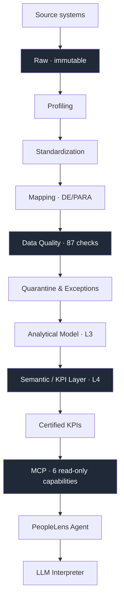

# PeopleLens AI

> **Governed People Analytics with an AI that knows what it must not answer.**
>
> An authorial project by **LevelInteligencIA** — People Analytics · Data Engineering · Data Quality · Data Governance · AI/MCP.

`351 tests passing` · `35 ADRs` · `18 KPI contracts` · `87 data quality checks` · `6 MCP capabilities`

---

## 1. What is PeopleLens AI?

PeopleLens AI turns heterogeneous, inconsistent, low-quality HR data into a
**governed analytical layer**, and exposes it through a natural-language
interface that knows what it can answer and, more importantly, what it
**cannot**.

The difference from a typical "chat with your HR data" demo is the direction of
authority. Here, the AI never defines a metric, never calculates one, and never
decides whether an answer is trustworthy. It reads language and it communicates
results. Everything in between is governed.

## 2. The business problem

HR data rarely arrives ready. It comes from multiple systems, in different
formats, with divergent names for the same concept, missing fields, duplicates,
inconsistent IDs, invalid dates and broken referential integrity. On top of
that, organizations change: the same area changes name, structure and owner
across the years.

The practical result is familiar to anyone who has led People Analytics:

- every analyst calculates turnover slightly differently;
- nobody can say where a number came from;
- leadership stops trusting the function.

Adding an LLM to that foundation does not solve the problem. It industrializes
it, because now the wrong number arrives fluently and with confidence.

## 3. Core thesis

> ### AI should not define or calculate People KPIs. People Analytics defines and governs them.

Everything in this repository follows from that sentence. The LLM is a
**semantic parser**, not an analyst: it converts a question into a structured
`Intent` and stops. It has no field in which to write SQL, a table name, a tool
name or a number — not because it is forbidden, but because the contract has no
such field.

## 4. Architecture



Layered pipeline: `L0 raw → L1 standardized → L2 conformed → L3 analytical →
L4 semantic`. Raw is **immutable**. Every transformed value keeps traceability
to its original value, its source system and the rule applied.

## 5. Governance model

| Layer | Responsibility |
|---|---|
| **People Analytics** | defines the KPI |
| **Data** | calculates it |
| **Governance** | certifies it |
| **MCP** | controls access to it |
| **Agent** | orchestrates the investigation |
| **LLM** | communicates the result |

Six roles, one direction of authority. The LLM sits at the end of that chain,
never at the start.

## 6. Trust model

Trust is a **lattice**, never an invented number:

```
trust_answer = min(trust_data, kpi_status_ceiling, actor_ceiling)
```

| Status | Band | Meaning |
|---|---|---|
| **CERTIFIED** | score ≥ 0.95 | approved by a named owner, on a recorded date |
| **LIMITED** | score ≥ 0.70 | answerable, with declared caveats |
| **BLOCKED** | below | not answerable; the refusal explains why |

`CERTIFIED` is **not computable**. It is recorded human approval, with an owner
and a date. A pipeline cannot promote itself.

Current KPI catalog: **5 CERTIFIED, 8 DECLARED, 5 BLOCKED** — 18 contracts.

## 7. AI boundaries

What the LLM cannot reach, and why it structurally cannot:

| Cannot | Why it is impossible, not merely forbidden |
|---|---|
| read raw data | the agent's closed context carries catalog, vocabulary and policy — no data values |
| write SQL | the `Intent` has no such field, and the semantic query rejects unknown keys |
| calculate a KPI | no field of the `Intent` is numeric; answers cite values from an envelope |
| modify the Truth Layer | the MCP exposes six capabilities, none of them a write |
| pick the tool | selection comes from a declared matrix, not from the model |
| silently suppress an ambiguity | `RESOLVE` **recomputes and overwrites** whatever the model proposed |
| correct data silently | no transformation drops its provenance |

> **The agent may investigate the data, but it cannot alter the truth of the data.**

The LLM's output is treated as **untrusted input** (ADR-0035): it is validated
locally even when the provider enforces a schema, and an unknown field rejects
the entire `Intent` rather than being ignored.

## 8. Smart Refusal

A refusal is a **result**, not a protocol error — and never a closed door. Every
refusal states what would resolve it.

The agent refuses when:

- the **period** is not supported by the KPI (wrong grain, outside coverage);
- a **dimension or member** is not in the governed vocabulary;
- the **evidence** does not sustain the requested response level;
- the **KPI is blocked** by governance.

Sixteen declared refusal classes, including `KPI_BLOQUEADO`,
`TERMO_DESCONHECIDO`, `GRAIN_INCOMPATIVEL`, `PERIODO_FORA_DE_COBERTURA`,
`POPULACAO_ABAIXO_DO_MINIMO` and `NIVEL_SEM_EVIDENCIA`.

The showcase case: *"What was turnover for Tecnologia in Q2 2026?"* returns
**zero data calls**. `turnover_rate` is annual, so there is no quarterly
version; and no department is called "Tecnologia". The answer offers the valid
departments and the valid periods, and never silently resolves "Tecnologia" to
"Engineering" — a wrongly mapped term is invisible, an unmapped one is visible.

## 9. MCP capabilities

Six, all read-only. No generic `execute_sql`, no `query_database`, no write.

| Capability | Answers |
|---|---|
| `get_kpi` | the governed value for a slice |
| `compare_kpi` | the governed variation between two periods |
| `breakdown_kpi` | the value broken down by permitted dimensions |
| `get_kpi_definition` | the contract: what it measures, how it is governed |
| `get_trust` | the confidence, and what would raise it |
| `get_lineage` | the chain from the number back to the source |

Every response is an envelope with one of four outcomes: `ANSWER`, `REFUSAL`,
`SUPPRESSED`, `ERROR`.

## 10. Agent loop

```
UNDERSTAND → RESOLVE → PLAN → ACT → OBSERVE → INTERPRET → DECIDE → RESPOND
```

There is deliberately **no VALIDATE step**. Trust, response ceiling, minimum-n
and governed states arrive already decided in the envelope; a step called
"validate" would invite the agent to re-evaluate what has been decided, and
re-evaluating is halfway to disagreeing.

`PLAN` is an **artifact**, not reasoning (ADR-0034). It exists before the first
MCP call, and each step declares capability, reason and objective. That is what
makes "why did the agent call this?" answerable six months later.

Every execution ends with one of ten declared `stop_reason` values.

## 11. LLM Interpreter

| | |
|---|---|
| Model | `gpt-5.6-luna` (OpenAI) |
| Output | structured output, `strict: true` |
| Schema | `intent/1.1`, closed field set; an unknown field rejects the whole `Intent` |
| Boundary | the LLM ends **before** schema validation and `RESOLVE` |
| Fallback | deterministic `RuleInterpreter`, on structural failure or budget exhaustion — **always declared, never silent** |

Empirical evaluation: **16 of 17 cases**, **4 of 4** PT-BR ↔ EN-US semantic
equivalence, no fallback, no retry. The single case that failed exposed a
contract gap rather than a model error — the model declined to invent a
comparison base that the governed vocabulary did not declare, which is the
correct behaviour. See `docs/llm_interpreter_p03_report.md`.

## 12. Demonstrated scenarios

Validated end-to-end with the real LLM and the real MCP.

| | Question | Result |
|---|---|---|
| **A** | *"What was turnover for Customer Service in 2025?"* | factual answer, `FACT`, trust `CERTIFIED`, one MCP call |
| **B** | *"Which area had the highest turnover in 2025?"* | ranking via `breakdown_kpi`, with minimum-n suppression applied |
| **C** | *"What was turnover for Tecnologia in Q2 2026?"* | **smart refusal**, zero data calls, valid options offered |
| **D** | *"How did turnover for Customer Service change between 2024 and 2025?"* | governed comparison, `2025` against `2024` — explicitly declared, never derived |

Scenario D is the reason `intent/1.1` exists. The earlier contract could only
express *relative* comparison bases, so a question naming two periods silently
fell back to "previous period" and compared 2024 against 2023. The fix was not
to make the plan guess better: it was to let the contract carry both periods
(RF-02).

## 13. Privacy

Suppression by **minimum n**, declared per KPI contract (currently 5 or 20
depending on the metric), plus **complementary suppression** so that a
suppressed cell cannot be recovered by subtracting the visible ones.

The agent cannot work around it: the harness blocks the sequence of narrowing
queries that would reconstruct a suppressed slice, and it blocks it **before**
the call, not after.

## 14. Data quality

**87 declared checks**, run by a purpose-built runner — checks live in
configuration, never in code.

| Dimension | Checks |
|---|---|
| Validity | 21 |
| Consistency | 16 |
| Completeness | 15 |
| Referential Integrity | 12 |
| Uniqueness | 9 |
| Reconciliation | 8 |
| Timeliness | 6 |

Three attributes govern each check, answering three different questions:
`threshold` (when it fails), `severity` (what happens to the failing row) and
`finding_class` (what kind of problem it is).

| Severity | Effect |
|---|---|
| `BLOCKER` | row goes to **quarantine**, never enters the analytical model |
| `CRITICAL` | row enters, and the check lowers the KPI trust score |
| `WARNING` | recorded and monitored, does not affect trust |
| `INFO` | observability only |

Governance pendencies are **named members**, never nulls: `UNMAPPED`,
`DECISAO_PENDENTE`, `TRADUCAO_PENDENTE`, `SEM_CHAVE_DE_ORIGEM`,
`FORA_DO_UNIVERSO`, `AINDA_NAO_OCORREU`, `ANTERIOR_A_SERIE`, `INDETERMINADA`.
A pending decision that hides as a null is a decision nobody will ever make.

## 15. Data lineage

```
KPI  →  business rule  →  analytical table  →  source system
```

`get_lineage` walks that chain, linked by `trace_id` across four logs:
`agent_run_log` (why it was called) → `mcp_call_log` (who called) →
`semantic_query_log` (what was asked) → `l3_run_id` (which load).

## 16. Synthetic data disclaimer

> **The dataset is entirely synthetic.** It describes a fictional company,
> NOVAORA, with roughly ten years of HR history across five LATAM countries.
>
> It does **not** represent any real company, country, population or
> demographic statistic. It was generated deliberately messy, to reproduce the
> data problems described in section 2 — and it was never optimized to produce
> favourable DEI results.

## 17. Bilingual product direction · Direcionamento bilíngue

The product is designed for **PT-BR and EN-US**. The same question in either
language must produce the same semantic `Intent`: language changes neither the
KPI, nor the period, nor the dimension, nor governance, nor the calculation.

Governed values are **never translated**. "Customer Service" stays
"Customer Service" in both languages; display labels are an interface concern,
not a licence for the model to invent or translate a dimension member.

> **Em português:** o PeopleLens é desenhado para operar em PT-BR e EN-US. A
> equivalência semântica entre os dois idiomas foi validada empiricamente (4 de
> 4 pares). A camada de interface bilíngue está registrada como requisito
> futuro (RF-01) e ainda não foi implementada. A documentação de arquitetura do
> projeto está em português, em `docs/`.

## 18. Tech stack

| | |
|---|---|
| Language | Python 3.11 |
| Dataframes | Polars |
| Query engine | DuckDB |
| Storage | Parquet + zstd, SQLite for governance logs |
| Config | YAML, declarative — rules live in configuration, not in code |
| LLM | OpenAI SDK, structured output (lazy import; the suite runs without it) |
| Tests | pytest — 351 tests |

## 19. Project status

**Architecture and core agent flow implemented and validated.**

| Phase | Status |
|---|---|
| F0–F7 · pipeline, quality, analytical model, semantic layer | implemented |
| MCP v0.1 · six read-only capabilities | implemented |
| Agent Harness + Loop | implemented |
| LLM Interpreter v0.1 | implemented, evaluated with the real model |
| RF-02 · explicit period comparison (`intent/1.1`) | implemented |
| User interface | **not implemented** |

ADRs 0024–0035 are recorded as **Proposta** (proposed) and await formal
acceptance as a block.

## 20. Roadmap

Short and honest. None of the below is implemented.

- **Interface / demo** — there is no UI; the agent is exercised through the
  harness and scripts.
- **RAG for governed definitions** — ADR-0016 already limits RAG to *context and
  definitions*, never to numbers. Not built.
- **Richer visual exploration** — breakdowns and comparisons rendered visually.
- **Bilingual interface layer (RF-01)** — registered, not implemented.
- **Wave 2 source systems** — the DQ catalog covers wave 1 today.
- **Trust threshold calibration** — thresholds are declared `PROVISIONAL`.

---

## Documentation

Architecture documentation lives in `docs/`, written in Portuguese.

| Document | Covers |
|---|---|
| `docs/adr/` | 35 Architecture Decision Records, with the rejected alternatives |
| `docs/F6_analytical_model.md` | analytical model: grain, temporality, provenance |
| `docs/F7_semantic_layer.md` | semantic contract between People Analytics, data and AI |
| `docs/MCP_SPEC_v0.1.md` | the six capabilities and the envelope |
| `docs/AGENT_HARNESS_SPEC_v0.1.md` | harness, loop and policies |
| `docs/LLM_INTERPRETER_SPEC_v0.1.md` | the LLM contract and its boundaries |
| `docs/llm_interpreter_p03_report.md` | empirical evaluation of the model |
| `docs/f5_data_quality.md` | the 87 checks, severity and quarantine |

---

<sub>PeopleLens AI · LevelInteligencIA · synthetic data, fictional company.</sub>
