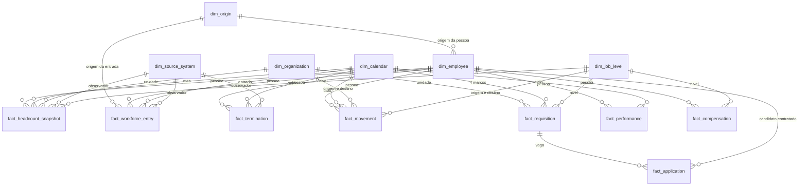

# F6 — SPEC do Modelo Analítico (v1.0, final)

**Status: SPEC final, aguardando autorização para implementar. Nada foi
implementado.**

Especificação da camada **L3 analytical** do ADR-0003, entre os dados
conformados e governados (L2, F3–F5) e a futura camada semântica de KPIs
(L4, F7).

> Princípio herdado das F3–F5: **antes de calcular, os universos precisam ser
> comparáveis.** Quatro achados daquelas fases foram a mesma coisa — uma
> comparação entre coisas não comparáveis produzindo um número plausível. A L3 é
> onde essa lição deixa de ser guarda de teste e vira estrutura.

---

## 0. O que mudou da proposta para esta versão

Sete diretrizes de revisão, e a primeira mudou o desenho.

| # | Diretriz | Efeito nesta versão |
|---|---|---|
| 1 | **proveniência ≠ identidade** | nova dimensão `dim_origin`, regra de proveniência governada em três níveis, e `dim_employee` com **chave de pessoa provisória** para registro sem identidade resolvida. Parte II |
| 2 | grain de headcount mantido | confirmado: pessoa × mês × sistema observador |
| 3 | Truth × Analytical fisicamente distintos | quatro camadas de separação, não só o schema. Parte IX.3 |
| 4 | aquisição ≠ contratação | `fact_hire` vira **`fact_workforce_entry`**, com `origin_sk` obrigatório e nunca padronizado como contratação |
| 5 | gaps documentados | mantidos e ampliados; nenhum campo fictício criado |
| 6 | F6 não calcula KPI | mantido, com a fronteira escrita em critério de aceite |
| 7 | novos casos de falha | 12 da proposta preservados, **5 acrescentados** |

A mudança na D-01 é a mais importante e a mais simples de enunciar: a proposta
anterior fazia a origem depender da identidade resolvida, o que rendia **zero**
pessoas classificadas hoje. Com proveniência separada de identidade, rende
**320 pessoas classificadas como aquisição imediatamente**, sem resolver uma
única identidade e sem inferir nada.

---

## Parte I — Base factual

### 1. O que a L3 herda

| Camada | Estado |
|---|---|
| L2 conformed | 300.419 linhas, 5 sistemas da onda 1 |
| L2 aprovado (pós-quarentena) | 300.411 linhas |
| identidade | `xref_employee_identity`, 44.926 vínculos |
| qualidade | 87 checks, 7 classes de achado, trust score por KPI × recorte |
| lineage | 48 relações entre objetos, 280.727 transformações de valor |
| governança | 57 exceções de mapeamento, 1.845 decisões de identidade em aberto |
| contratos | 18 KPIs com `depends_on_checks` e `depends_on_mappings` |

### 2. Datasets declarados que não existem

Restringem o modelo e não podem ser contornados inventando estrutura:

| Declarado | Situação | Consequência |
|---|---|---|
| `HRIS_LEGACY.org_structure` | nunca projetado | `dim_organization` sem fonte própria |
| `HRIS_CORE.org_structure` | nunca projetado | idem |
| `VIVAMARKET_LEGACY.compensation` | salário vem inline no cadastro | remuneração da aquisição é um ponto, não série |
| `ATS_CLOUD.candidate` | dados vêm inline na candidatura | sem dimensão de candidato |
| onda 2 inteira | fora de escopo | sem engajamento, aprendizagem, organograma, segunda aquisição |

### 3. Campos que nenhuma fonte da onda 1 tem

Verificado coluna a coluna:

| Ausente | O que sustentaria | Impacto |
|---|---|---|
| **motivo de desligamento** | voluntário × involuntário, regrettable attrition | **alto** |
| **campo de origem da pessoa** | crescimento orgânico × aquisição | **alto**, resolvido por proveniência (Parte II) |
| **estrutura organizacional datada** | `dim_organization` com histórico próprio | **médio** |
| `centro_custo` na folha | atribuição de valor a centro de custo | **médio**, regido por DQ-01 |

A camada de verdade tem os quatro. Isso é útil para medir o buraco e é a maior
tentação desta fase: um teste proíbe o código de construção de ler a verdade.

---

## Parte II — Proveniência e identidade são coisas diferentes

Esta parte existe por causa da diretriz 1 e é a espinha do modelo.

### 4. A distinção

| | Proveniência | Identidade |
|---|---|---|
| **pergunta** | de qual sistema este registro veio, e o que isso prova sobre como a pessoa entrou | estes dois registros são a mesma pessoa? |
| **unidade** | o registro | o par de registros |
| **mecanismo** | declaração em `config/sources.yaml` | `xref_employee_identity` (ADR-0004) |
| **quando é conhecida** | **sempre**: o registro veio de algum lugar | só quando o vínculo é resolvido |
| **erra como** | classificação errada, visível na configuração | fusão errada de pessoas, invisível |

Três consequências que ficam escritas porque a confusão entre elas é o erro que
esta revisão corrige:

1. **origem conhecida não implica identidade resolvida.** Os 320 registros da
   VivaMarket são inequivocamente da aquisição, e nenhum deles tem vínculo
   aprovado com o HRIS corporativo;
2. **identidade resolvida não é pré-requisito para classificar origem.** Exigir
   isso, como a proposta anterior fazia, adiava indefinidamente uma informação
   que já está disponível;
3. **identidade continua sendo o único mecanismo de junção entre sistemas.**
   Proveniência não junta ninguém com ninguém.

### 5. A regra de proveniência governada

Declarada em `config/sources.yaml`, auditável, sem similaridade, sem nome, sem
cargo, sem nenhum atributo da pessoa. Três níveis, avaliados em ordem, e o
primeiro que se aplica vence:

| Nível | Regra | Base | Determinística? |
|---|---|---|---|
| **P1** | o sistema-fonte determina a origem | `sources.yaml`, campo novo `determines_origin` | sim: `VIVAMARKET_LEGACY → AQUISICAO_VIVAMARKET` |
| **P2** | admissão anterior ao início da série declarada | `generation.yaml`, `2016-01-01` | sim: quem já estava na casa não foi contratado nem adquirido na janela |
| **P3** | candidatura no ATS que resultou em admissão, com identidade resolvida | `ATS_CLOUD.application` | sim: **evidência positiva de processo**, não similaridade |
| **—** | nenhuma das anteriores | — | `INDETERMINADA` |

**`HRIS_CORE` e `HRIS_LEGACY` não determinam origem**, e isso é declarado
explicitamente. Marcá-los como "orgânico" seria o erro exato que a diretriz 4
proíbe: toda pessoa absorvida da VivaMarket aparece no HRIS corporativo, e
chamá-la de contratação orgânica fecharia o headcount mentindo.

### 6. O que a regra rende hoje, medido

| Origem | Pessoas | Como foi determinada |
|---|---|---|
| `AQUISICAO_VIVAMARKET` | **320** | P1, sem nenhuma identidade resolvida |
| `POPULACAO_INICIAL` | 222 no HRIS_CORE, 467 no HRIS_LEGACY | P2 |
| `CONTRATACAO` | **1.499** | P3, evidência positiva no ATS |
| `INDETERMINADA` | 2.390 de 4.111 no HRIS_CORE (**58,1%**) | nenhuma regra se aplica |

E o limite superior da contaminação fica conhecido e declarável: **no máximo 320
das 4.111 pessoas do HRIS corporativo (7,8%)** classificadas como
`INDETERMINADA` podem, na verdade, ser da aquisição. Esse número é o teto que a
fila de identidade vai reduzindo à medida que for trabalhada.

`INDETERMINADA` em 58% é desconfortável e é a resposta correta. A alternativa —
chamar o resto de orgânico — produziria 100% de cobertura e uma taxa de
contratação inflada em até 7,8%, com cara de fato.

### 7. `dim_employee` precisa de uma chave que funcione sem identidade

Se a chave da dimensão fosse apenas o `employee_id` corporativo, os 320
registros da VivaMarket — que não têm `employee_id` — colapsariam todos no
membro reservado e deixariam de ser contáveis como pessoas. Saberíamos que
existem 320 registros de aquisição e não conseguiríamos contar 320 pessoas.

**`dim_employee` passa a ter `party_key`**, a chave da pessoa analítica:

| Situação | `party_key` | `is_provisional_person` |
|---|---|---|
| identidade RESOLVED | `EMP:<employee_id>` | `false` |
| qualquer outro status | `SRC:<sistema>:<id de origem>` | `true` |

Uma pessoa provisória é uma pessoa de verdade, contável, com origem
classificada, cujo vínculo com outras aparições dela mesma está em aberto. Não é
um erro a corrigir: é o estado honesto de quem chegou por uma carga sem
identificador corporativo.

Quando a fila de governança resolver o vínculo, as duas pessoas se fundem, e a
fusão é **evento governado e registrado**, não um efeito colateral de recarga.

Isto **não cria matching**. É o oposto: recusa fundir sem decisão humana.

---

## Parte III — Dimensões

Seis. Nenhuma existe para aumentar a contagem.

### 8.1 `dim_employee`

| | |
|---|---|
| **Finalidade** | a pessoa analítica e seus atributos ao longo do tempo |
| **Grain** | **uma linha por pessoa analítica × versão de atributos**, vigência fechada |
| **Chave** | `employee_sk` |
| **Chave natural** | `party_key` + `effective_from` |
| **Temporalidade** | SCD tipo 2: `effective_from`, `effective_to`, `is_current`, `change_reason` |
| **Fonte** | `employee_master` e `movement` dos dois HRIS, `VIVAMARKET_LEGACY.employee_master` |

Atributos: nome pseudonimizado, país, business unit, departamento,
sub_departamento, job_family, job_level, job_title, localidade, centro de custo,
gestor, tipo de contrato, situação, FTE, gênero, raça e cor com data de
declaração, deficiência idem, admissão, desligamento, **`origin_sk`**,
**`identity_status`**, **`is_provisional_person`**.

Nova versão abre quando muda qualquer atributo que um KPI recorta: departamento,
sub_departamento, nível, gestor, localidade, país, tipo de contrato, FTE,
situação. Nome e título não abrem versão — abrir versão para tudo transforma
SCD2 em log de auditoria.

`change_reason` vem do movimento observado quando existe; quando a mudança só
aparece por diferença entre snapshots, é `Observado sem evento`, que é honesto e
diferente de inventar `Transfer`.

**Membros reservados:** `-1` registro sem chave de origem utilizável, `-4` fora
do universo conhecido. Identidade não resolvida **não** cai em `-1`: vira pessoa
provisória (seção 7).

### 8.2 `dim_origin` — nova

| | |
|---|---|
| **Finalidade** | vocabulário governado de origem, usado em dois papéis |
| **Grain** | **uma linha por classe de origem** |
| **Chave** | `origin_sk` |
| **Fonte** | `config/sources.yaml` |
| **Temporalidade** | nenhuma; mudar o vocabulário exige ADR |

| `origin_sk` | Código | Regra que o atribui |
|---|---|---|
| 1 | `CONTRATACAO` | P3 |
| 2 | `AQUISICAO_VIVAMARKET` | P1 |
| 3 | `AQUISICAO_COMPRAFACIL` | P1, onda 2, sem dado hoje |
| 4 | `POPULACAO_INICIAL` | P2 |
| `-1` | `INDETERMINADA` | nenhuma regra se aplica |

Atributos: `is_acquisition`, `is_hire`, `determination_rule` (P1, P2, P3 ou
nenhuma), `evidence_source`.

Dois papéis, um vocabulário: `dim_employee.origin_sk` é a origem **da pessoa**;
`fact_workforce_entry.origin_sk` é a origem **daquela entrada**. Separar em duas
dimensões criaria dois vocabulários que podem divergir.

### 8.3 `dim_organization`

| | |
|---|---|
| **Grain** | **uma linha por unidade organizacional × versão** |
| **Chave** | `org_sk`; natural (`country`, `business_unit`, `department`, `sub_department`) + `effective_from` |
| **Temporalidade** | SCD tipo 2 |
| **Fonte** | **derivada** de combinações observadas nos dois HRIS e em `ATS_CLOUD.requisition` |

Sem fonte própria (`org_structure` nunca projetado). Consequências declaradas em
coluna `is_derived = true`:

- unidade que existe sem ninguém alocado **não aparece**;
- a data de criação é aproximada pela primeira alocação observada;
- renomear é indistinguível de criar outra e mover todo mundo.

**Membros reservados:** `-1` não mapeado, `-2` decisão pendente, `-3` tradução
pendente.

### 8.4 `dim_calendar`

| | |
|---|---|
| **Grain** | **uma linha por dia** |
| **Chave** | `date_sk` (`YYYYMMDD`) |
| **Fonte** | **gerada de `config/generation.yaml`, nunca dos dados** |
| **Cobertura** | 2016-01-01 até o fim da série declarada, mais um ano |

A justificativa de gerar do config é o defeito D18: um calendário derivado dos
dados não contém os meses em que a carga falhou, e um mês que não existe no eixo
é um buraco que some do gráfico. `DQ_TIME_003` existe para detectar exatamente
isso, e seria contraditório construir o eixo de um jeito que esconde o que o
check procura.

**Membro reservado:** `-5` ainda não ocorreu.

### 8.5 `dim_job_level`

| | |
|---|---|
| **Grain** | **uma linha por código de nível** (13) |
| **Chave** | `job_level_sk` |
| **Fonte** | `config/generation.yaml`, `organization.job_levels` |

Existe porque **promoção, rebaixamento e liderança dependem de ordem**, e ordem
é da escala, não da pessoa. Guardar o rank em `dim_employee` o duplicaria em
cada versão SCD2 e permitiria que duas versões da mesma pessoa discordassem
sobre quanto vale IC4.

Atributos: `rank`, `job_level_group`, `is_leadership`.

**Membro reservado:** `-2` decisão pendente — onde `N4` e `N5` da VivaMarket
continuam nomeados e contáveis.

### 8.6 `dim_source_system`

| | |
|---|---|
| **Grain** | **uma linha por sistema-fonte × versão de vigência** |
| **Chave** | `source_sk` |
| **Fonte** | `config/sources.yaml` |

Atributos: onda, `active_from`, `active_to`, países, `field_language`,
`population_rule`, `has_enterprise_employee_id`, `is_system_of_record` por
período, **`determines_origin`**.

É a dimensão que o achado 1 da F5 exige: se vigência e população de cada fonte
ficam só em comentário de YAML, o erro se repete na L4.

**Membro reservado:** `-6` fora da vigência do sistema.

### 8.7 Recusadas

`dim_department` (atributo de `dim_organization`), `dim_country` (cinco valores
governados), `dim_gender` (quatro valores, sem atributos), `dim_candidate`
(dataset não projetado), `dim_manager` (duplicaria `dim_employee` e as duas
poderiam discordar), `dim_cost_center` (sem atributos, e a folha não tem o campo),
`dim_entry_type` (seria um segundo vocabulário de origem).

---

## Parte IV — Fatos

Sete, divididos por grain.

### 9.1 `fact_headcount_snapshot`

| | |
|---|---|
| **Grain** | **pessoa × mês de referência × sistema observador** |
| **Chave** | (`employee_sk`, `date_sk`, `source_sk`) |
| **Métricas** | `headcount` (1), `fte` |
| **População** | os dois HRIS; **a folha fica fora** |
| **Fonte** | `HRIS_CORE.headcount_snapshot`, `HRIS_LEGACY.headcount_snapshot` |

O sistema observador faz parte do grain porque entre maio e novembro de 2019 os
dois HRIS descrevem a mesma pessoa no mesmo mês. Grain pessoa × mês forçaria uma
escolha silenciosa e apagaria a evidência que `DQ_RECON_005` mede.

`is_system_of_record`, declarado por período, marca qual observação vale. Somar
sem esse filtro duplica a sobreposição, e essa duplicação **tem que acontecer**:
é o caso de falha F-01.

A folha fica fora por dois motivos somados: 59% sem identidade resolvida e uma
definição própria de ativo. A comparação entre as duas continua nas
reconciliações da F5, onde já funciona.

### 9.2 `fact_workforce_entry` — renomeada

| | |
|---|---|
| **Grain** | **pessoa × data de entrada × sistema observador** |
| **Chave** | (`employee_sk`, `date_sk`, `source_sk`) |
| **Métricas** | `entries` (1) |
| **Dimensões** | employee, calendar, source_system, **origin (obrigatória)** |
| **Fonte** | `hire_date` dos cadastros, carga única da VivaMarket |
| **Evidência** | `derivado_de_atributo` |

Era `fact_hire` na proposta. Renomeada por causa da diretriz 4: **entrada na
força de trabalho não é sinônimo de contratação**, e um fato chamado `hire`
convida a somar tudo como contratação para fechar headcount.

`origin_sk` é **obrigatório e nunca tem padrão**. Uma entrada sem regra de
proveniência aplicável fica `INDETERMINADA`, e um KPI de contratação filtra
`is_hire = true` explicitamente. Contar `INDETERMINADA` como contratação é o
caso de falha F-15.

`event_evidence` distingue `observado` de `derivado_de_atributo`, e aqui é
sempre o segundo: a entrada é reconstruída de um campo do cadastro atual. Um
cadastro reescrito muda o passado sem rastro, e quem lê o número precisa saber.

Readmissão não é representável na onda 1: o cadastro guarda uma data de
admissão. Gap G-04.

### 9.3 `fact_termination`

| | |
|---|---|
| **Grain** | **pessoa × data de desligamento × sistema observador** |
| **Chave** | (`employee_sk`, `date_sk`, `source_sk`) |
| **Métricas** | `terminations` (1), `tenure_months` |
| **Fonte** | `termination_date` / `DT_DEMISSAO` dos dois HRIS |
| **Evidência** | `derivado_de_atributo` |

**Sem motivo, sem tipo, sem flag de voluntariedade.** As colunas
`termination_reason` e `voluntary_flag` **não são criadas vazias**, porque coluna
nula convida a preencher. Turnover é contável; attrition voluntária e regrettable
attrition não existem na onda 1. Gap G-01, e caso de falha F-09.

### 9.4 `fact_movement`

| | |
|---|---|
| **Grain** | **uma movimentação observada** (pessoa × data × tipo) |
| **Chave** | `movement_sk` |
| **Métricas** | `movements` (1), `level_delta` |
| **Dimensões** | employee, calendar, source_system, e **dois papéis** de organization e de job_level: origem e destino |
| **Fonte** | `HRIS_CORE.movement`, `HRIS_LEGACY.movement` |
| **Evidência** | **observado** |

O único fato de evento realmente observado da onda 1. `level_delta` é aritmética
sobre o rank declarado; chamar `level_delta > 0` de promoção é regra de negócio,
e é F7.

### 9.5 `fact_requisition`

| | |
|---|---|
| **Grain** | **uma requisição** (snapshot acumulativo) |
| **Chave** | `requisition_sk` |
| **Dimensões** | organization, job_level, source_system, **quatro papéis de calendar**: abertura, aprovação, publicação, admissão |
| **Fonte** | `ATS_CLOUD.requisition` |

Marco não atingido aponta para o membro `-5` do calendário, nunca nulo.

### 9.6 `fact_application`

| | |
|---|---|
| **Grain** | **requisição × candidato** |
| **Chave** | `application_sk` |
| **Métricas** | `applications` (1), `offers`, `accepts`, durações |
| **Fonte** | `ATS_CLOUD.application` |

Separado por ADR-0005, e o grain confirma a razão: juntar multiplicaria vagas
por candidatos. É também a fonte da evidência P3 de proveniência.

### 9.7 `fact_performance`

| | |
|---|---|
| **Grain** | **pessoa × ciclo de avaliação** |
| **Chave** | (`employee_sk`, `review_cycle`) |
| **Fonte** | `HRIS_CORE.performance` |

Guarda a nota padronizada **e** `scale_type`, porque comparar distribuição
através da mudança de escala de 2021 é armadilha que a L4 precisa enxergar.

### 9.8 `fact_compensation`

| | |
|---|---|
| **Grain** | **pessoa × data de vigência da mudança salarial** |
| **Chave** | (`employee_sk`, `date_sk`, `source_sk`) |
| **Fonte** | `PAYROLL_BR.compensation` |
| **População** | **só Brasil, só identidade resolvida (41%)** |

Sem conversão de moeda: converter é interpretação, e é L4 (ADR-0006).

### 9.9 Recusados

`fact_engagement` e `fact_learning` (onda 2), `fact_payroll_headcount` e
`fact_reconciliation` (duplicariam a F5, criando duas verdades),
`fact_org_structure` (sem fonte), tabela única de eventos (forçaria `old_*` nulo
em dois terços das linhas e misturaria grain observado com derivado).

---

## Parte V — Matriz final

| Tabela | Grain | Chave | Fontes | Dependências | KPIs suportados |
|---|---|---|---|---|---|
| `dim_employee` | pessoa analítica × versão | `employee_sk` | 2 HRIS `employee_master` + `movement`, VivaMarket | `xref_employee_identity`, `dim_origin` | todos |
| `dim_origin` | classe de origem | `origin_sk` | `config/sources.yaml` | nenhuma | hiring, turnover, headcount |
| `dim_organization` | unidade org × versão | `org_sk` | derivada | `ref_department_mapping`, `ref_country_mapping` | headcount, turnover, mobility |
| `dim_calendar` | dia | `date_sk` | `config/generation.yaml` | nenhuma | todos |
| `dim_job_level` | código de nível | `job_level_sk` | `config/generation.yaml` | `ref_job_level_mapping` | women_in_leadership, promotion, compa_ratio |
| `dim_source_system` | sistema × vigência | `source_sk` | `config/sources.yaml` | nenhuma | todos, via comparabilidade |
| `fact_headcount_snapshot` | pessoa × mês × sistema | (employee, date, source) | 2 `headcount_snapshot` | employee, organization, calendar, job_level, source | headcount, fte, span_of_control, DEI, tenure |
| `fact_workforce_entry` | pessoa × data entrada × sistema | (employee, date, source) | `hire_date`, carga VivaMarket | employee, calendar, source, **origin** | hiring_volume, turnover (denominador) |
| `fact_termination` | pessoa × data saída × sistema | (employee, date, source) | `termination_date` | employee, calendar, source | turnover_rate, tenure |
| `fact_movement` | movimentação observada | `movement_sk` | 2 `movement` | employee, organization ×2, job_level ×2 | internal_mobility_rate, promotion_rate |
| `fact_requisition` | requisição | `requisition_sk` | `ATS_CLOUD.requisition` | organization, calendar ×4, job_level | time_to_fill, hiring_volume |
| `fact_application` | requisição × candidato | `application_sk` | `ATS_CLOUD.application` | fact_requisition, calendar ×4, employee | time_to_hire, offer_acceptance_rate |
| `fact_performance` | pessoa × ciclo | (employee, review_cycle) | `HRIS_CORE.performance` | employee, calendar | performance_distribution, promotion_rate |
| `fact_compensation` | pessoa × data vigência | (employee, date, source) | `PAYROLL_BR.compensation` | employee, job_level | compa_ratio, pay_gap |

### 10. Diagrama lógico



---

## Parte VI — Temporalidade

### 11. Como cada mudança é representada

| Mudança | Onde vive | Como |
|---|---|---|
| **entrada por contratação** | `fact_workforce_entry` com `origin = CONTRATACAO` + 1ª versão em `dim_employee` | exige evidência P3 |
| **entrada por aquisição** | `fact_workforce_entry` com `origin = AQUISICAO_*` | P1; **nunca convertida em contratação** |
| **entrada indeterminada** | `fact_workforce_entry` com `origin = INDETERMINADA` | não conta como contratação nem como aquisição |
| **desligamento** | `fact_termination` + versão final | versão **fechada, não apagada** |
| **transferência** | `fact_movement` + nova versão | `org_sk_from` → `org_sk_to` |
| **mudança de gestor** | `fact_movement` + nova versão | abre versão porque `span_of_control` recorta por ele |
| **mudança de cargo** | nova versão apenas | não abre movimento se o nível não mudou |
| **mudança de nível** | `fact_movement` com `level_delta ≠ 0` | interpretar o sinal é F7 |
| **mudança organizacional** | nova versão em `dim_organization` | vigência **derivada** (G-02) |
| **mudança de escala de performance** | `fact_performance.scale_type` | o DE/PARA com vigência já resolve o valor |

### 12. Regras invioláveis

1. **Nenhuma versão é atualizada no lugar.** Mudança fecha a vigente com
   `effective_to = data − 1` e abre outra. Reprocessar não pode produzir menos
   linhas para um período já fechado.
2. **Todo fato se liga à versão vigente na data do fato**, nunca à atual. Contar
   mulheres em liderança em 2018 com o nível de 2026 é reescrever a história.
3. **Nenhum fato aponta para data futura**, exceto marcos não atingidos, que vão
   para o membro `-5`.
4. **O calendário é completo mesmo onde não há dado.** Zero visível e ausência
   silenciosa são informações diferentes.
5. **Fusão de pessoa provisória é evento governado**, registrado, nunca efeito
   colateral de recarga.

---

## Parte VII — Identidade

### 13. Uso da identidade governada

**Nenhuma lógica nova de matching. Nenhuma similaridade adicional.**

| Status no `xref` | Efeito |
|---|---|
| `RESOLVED` | `party_key = EMP:<employee_id>`, pessoa consolidada |
| `MANUAL_REVIEW`, `AMBIGUOUS`, `UNRESOLVED` | pessoa provisória, `party_key = SRC:<sistema>:<id>` |

O ADR-0004 proíbe promover match por nome, e a L3 não é exceção.

| Sistema | Identidade resolvida | Efeito |
|---|---|---|
| HRIS_CORE | 100% | população íntegra |
| HRIS_LEGACY | 100% | período 2016–2019 íntegro |
| PAYROLL_BR | 41% | `fact_compensation` cobre 41% da folha BR |
| ATS_CLOUD | 4,8% | esperado; alimenta a evidência P3 |
| VIVAMARKET_LEGACY | **0%** (320 em `MANUAL_REVIEW`) | 320 pessoas provisórias, **com origem classificada** |

Os 320 não estão sem candidato: estão com candidato **não aprovado**. A
diferença importa, porque significa que a fila de governança tem 320 decisões
prontas para serem tomadas, não 320 buscas para fazer.

---

## Parte VIII — Governança e qualidade

### 14. Membros reservados

**Pendência de governança não vira nulo e não vira valor válido.**

| Chave | Membro | Classe da F5 | Dimensão |
|---|---|---|---|
| `-1` | não mapeado | `NAO_MAPEADO` | `dim_organization` |
| `-1` | sem chave de origem utilizável | — | `dim_employee` |
| `-1` | origem indeterminada | — | `dim_origin` |
| `-2` | decisão de negócio pendente | `DECISAO_PENDENTE` | `dim_job_level`, `dim_organization` |
| `-3` | tradução pendente | `NAO_MAPEADO` | `dim_organization` |
| `-4` | não informado | `AUSENCIA_LEGITIMA` | `dim_employee` |
| `-5` | ainda não ocorreu | — | `dim_calendar` |
| `-6` | fora da vigência | `DESATUALIZADO` | `dim_source_system` |

### 15. Como cada sinal da F5 atravessa a L3

| Sinal | Comportamento |
|---|---|
| `BLOCKER` | a linha **não entra**: a L3 lê `conformed_approved`, já pós-quarentena |
| `CRITICAL` | a linha entra; o efeito é no trust score do KPI dependente |
| `WARNING`, `INFO` | entram, sem efeito no modelo |
| `UNMAPPED` | membro `-1` da dimensão |
| `DECISAO_PENDENTE` | membro `-2` |
| `TRADUCAO_PENDENTE` | membro `-3` |
| `IDENTIDADE_NAO_RESOLVIDA` | pessoa provisória, **não** membro reservado |
| `DESATUALIZADO` | mês existe no calendário, sem linhas no fato; nunca interpolado |
| `DIVERGENCIA` | não entra no modelo; vive nas reconciliações da F5 |
| quarentena | **nunca entra em silêncio**, e a exclusão é registrada |

### 16. `analytical_exclusions`

Metadado: uma linha por registro recusado pela L3, com camada de origem,
`_row_id`, regra que excluiu e classe do achado.

Existe porque "quarentena não entra" e "ninguém sabe o que ficou de fora" são
compatíveis, e a segunda é inaceitável. Sem ela, "quantas pessoas tem a empresa"
perde a frase que a torna honesta: *e oito registros ficaram de fora porque a
data de admissão não converteu*.

---

## Parte IX — Comparabilidade e separação de universos

### 17. O que o modelo controla

| Eixo | Como |
|---|---|
| população | `dim_source_system.population_rule`; a folha fica fora do fato de headcount |
| período | `dim_calendar` independente dos dados, mais `active_from`/`active_to` |
| país | `std_country` conformado; membro `-1` para não mapeado |
| fonte | `source_sk` no grain de todo fato de estado e de evento derivado |
| vigência | SCD2 nas dimensões |
| escopo organizacional | `org_sk` vigente na data do fato |
| chave de comparação | `is_system_of_record` por período |
| **proveniência** | `origin_sk`, determinística e auditável |

### 18. Regra de agregação

**Nenhuma agregação cruza sistemas-fonte sem declarar que os está cruzando.**
Toda consulta de headcount filtra `is_system_of_record` ou declara a união. Não
é burocracia: é o erro que passou despercebido na F5 até a versão mês a mês
aparecer.

### 19. Truth × Analytical fisicamente distintos (diretriz 3)

Quatro camadas de separação, e não só o schema:

1. **Caminho:** `data/synthetic/truth/` × `data/processed/analytical/`.
2. **Coluna obrigatória `layer`** em toda tabela das duas camadas, com valor
   `truth` ou `analytical`. Um leitor que receba a tabela errada descobre pela
   própria tabela, sem depender do caminho de onde veio.
3. **Manifesto próprio por camada**, com `run_id`, `profile`, `scale`, `seed` e
   `config_hash`, e `check_provenance` guardando **três pares**: raw × verdade,
   raw × analítico, verdade × analítico.
4. **Schema no DuckDB:** `truth.*` e `analytical.*`, sem tabela não qualificada.

E a regra que fecha: **nenhum código de construção da L3 lê
`data/synthetic/truth/`**. A verdade é insumo de avaliação, nunca de construção.
Teste F-13.

---

## Parte X — A aquisição VivaMarket

### 20. O que muda com a proveniência governada

| | Proposta anterior | Esta versão |
|---|---|---|
| pessoas classificadas como aquisição hoje | **0** | **320** |
| depende de identidade resolvida | sim | **não** |
| mecanismo | `xref` | `sources.yaml`, nível P1 |
| auditável | pela fila de governança | pela configuração versionada |

### 21. O que continua em aberto

As 320 pessoas da aquisição existem como pessoas provisórias e **não estão
ligadas** às suas contrapartes no HRIS corporativo. Consequências honestas:

- contar a população da aquisição: **possível**, 320;
- separar turnover da população adquirida dentro do HRIS: **não**, porque no
  HRIS elas são indistinguíveis;
- medir integração pós-aquisição: **não**, pelo mesmo motivo;
- limite superior da contaminação em `INDETERMINADA`: **7,8%** do HRIS
  corporativo, e esse teto cai conforme as 320 decisões forem tomadas.

### 22. O que continua proibido

Inferir origem por data de admissão, departamento, localidade, nome, cargo,
senioridade ou qualquer combinação de atributos. Nenhum deles carrega a
informação, e o resultado seria um número com cara de fato — a falha
característica que apareceu quatro vezes nas F3–F5. Casos de falha F-08 e F-15.

---

## Parte XI — Preparação para a F7

### 23. Suporte aos 18 KPIs contratados

Sem fórmula: fórmula é F7. O que a matriz mostra é se grão e dimensionalidade
existem.

| Família | Sustentado? | Observação |
|---|---|---|
| **Headcount** | sim | grain pessoa × mês × sistema cobre os recortes contratados |
| **Turnover** | parcial | contagem sim; voluntário × involuntário **não** (G-01) |
| **Attrition** | não | regrettable attrition exige motivo, que não existe |
| **Hiring** | parcial | `hiring_volume` exige `origin = CONTRATACAO`, hoje 1.499 de 4.111 com evidência; time_to_fill e offer_acceptance íntegros |
| **Mobility** | sim | `fact_movement` é observado, com origem e destino |
| **DEI** | sim | `is_leadership` declarado; não declaração é membro `-4` e não some do denominador |
| **Performance** | sim, com cuidado | `scale_type` no fato para não comparar através de 2021 |
| **Compensation** | parcial | só BR, 41%, sem recorte por centro de custo (DQ-01) |

Nenhum KPI exige tabela que esta SPEC não proponha.

### 24. A fronteira que a L3 não atravessa

Definição de liderança além do atributo declarado, banda salarial, conversão de
moeda, meta, limiar, classificação de promoção a partir do `level_delta`,
supressão por n mínimo, e qualquer fórmula de KPI. Tudo L4. Critério A-15.

---

## Parte XII — Lineage

### 25. A cadeia preservada

```
analytical (L3)  →  conformed (L2)  →  standardized (L1)  →  raw (L0)
   fact/dim            _row_id          transformation_log     arquivo original
```

1. **Nos fatos:** `source_system`, `source_dataset`, `source_row_id`. Quando uma
   linha analítica vem de várias de origem, a ligação vai para a ponte
   `analytical_lineage`, não para uma coluna de lista dentro do fato.
2. **Nas dimensões SCD2:** o `_row_id` da observação que abriu cada versão, para
   que "por que esta pessoa mudou de departamento em março" tenha resposta.
3. **No nível de objeto:** `data_lineage` ganha `analytical.<tabela> ←
   conformed.<dataset>`, no formato das 48 que já existem.
4. **Na proveniência:** `dim_origin.determination_rule` e `evidence_source`
   registram **por que** aquela origem foi atribuída, e o `_row_id` da evidência
   quando ela é P3.
5. **Nada é duplicado.** `transformation_log` continua a única fonte sobre
   transformação de valor, e a L3 chega nele pelo `_row_id`.

---

## Parte XIII — Tecnologia

Sem tecnologia nova; o ADR-0009 já definiu tudo.

| Camada | Tecnologia | Situação |
|---|---|---|
| construção | Python 3.11 + Polars | em uso desde a F1 |
| armazenamento | Parquet + zstd | em uso desde a F1 |
| consulta | **DuckDB**, views sobre Parquet, schemas `truth` e `analytical` | declarado no ADR-0009, entra agora |
| governança | SQLite | em uso desde a F3 |
| versionamento | Git | em uso |

`fact_headcount_snapshot` é a maior tabela: ~131 mil linhas no perfil `dev`,
~1,3 milhão no completo. Confortável para DuckDB em máquina única. Postgres,
Spark, Databricks e Snowflake não se justificam; se algum dia se justificarem, é
ADR próprio e não preferência.

---

## Parte XIV — Critérios de aceite

### 26. Devem passar (17)

| # | Critério |
|---|---|
| A-01 | toda tabela declara o grain em metadado legível por código |
| A-02 | nenhuma tabela mistura grains: a chave declarada é única |
| A-03 | toda chave estrangeira resolve numa linha da dimensão, incluindo membros negativos |
| A-04 | nenhuma chave estrangeira é nula |
| A-05 | histórico não é sobrescrito: reprocessar não reduz versões de período fechado |
| A-06 | todo fato se liga à versão da dimensão vigente **na data do fato** |
| A-07 | vigências da mesma entidade não se sobrepõem nem deixam buraco |
| A-08 | identidade não resolvida vira pessoa provisória contável, nunca é descartada |
| A-09 | nenhuma linha em quarentena entra no modelo |
| A-10 | toda exclusão fica em `analytical_exclusions`: quarentena + exclusões = diferença entre L2 e L3 |
| A-11 | `N4` e `N5` continuam contáveis no membro `-2` de `dim_job_level` |
| A-12 | o calendário cobre meses sem dado |
| A-13 | lineage fecha até o `_row_id`, e a proveniência registra a regra que a determinou |
| A-14 | `check_provenance` guarda os três pares de camadas |
| A-15 | nenhum KPI é calculado na L3: nenhuma referência a `config/kpis/` no código de construção |
| A-16 | o modelo é determinístico: duas execuções com o mesmo seed produzem tabelas idênticas |
| A-17 | toda tabela analítica tem `layer`, `run_id` e manifesto |

### 27. Devem falhar (17)

Os 12 da proposta, preservados, mais 5 exigidos pela diretriz 7.

| # | O que deve falhar | Por quê |
|---|---|---|
| F-01 | somar headcount sem filtrar `is_system_of_record` e bater com a verdade em 2019 | tem que duplicar; se não duplicar, o grain está errado |
| F-02 | uma pessoa com duas versões vigentes de `dim_employee` na mesma data | SCD2 quebrado |
| F-03 | um fato apontando para a versão **atual** em vez da vigente na data | reescreve a história |
| F-04 | `job_level` nulo onde a origem era `N4` | `N4` vira membro `-2`, não some |
| F-05 | uma linha em quarentena presente em qualquer fato | quarentena entrando em silêncio |
| F-06 | `party_key` consolidado (`EMP:`) para linha com `match_status = MANUAL_REVIEW` | promoveria match não governado |
| F-07 | `dim_organization` com vigência anterior ao primeiro dado observado | vigência derivada fingindo precisão |
| F-08 | pico de entradas em agosto de 2022 | sinal de que alguém inferiu a aquisição por data |
| F-09 | `termination_reason` existindo com qualquer valor | não há fonte; se existe, foi inventado |
| F-10 | `fact_compensation` cobrindo mais de 41% da folha | teria usado identidade não resolvida |
| F-11 | um mês com falha de carga ausente do `dim_calendar` | esconde o buraco que `DQ_TIME_003` mede |
| F-12 | duas execuções produzindo contagens diferentes | não determinístico |
| **F-13** | código de construção da L3 lendo `data/synthetic/truth/` | **colisão Truth × Analytical**: o modelo passaria na avaliação contra si mesmo |
| **F-14** | uma tabela sem a coluna `layer`, ou com `layer` errada | **colisão Truth × Analytical**: objetos fisicamente indistinguíveis |
| **F-15** | `hiring_volume` contando `origin = INDETERMINADA` ou `AQUISICAO_*` | **contratação confundida com aquisição** |
| **F-16** | qualquer pessoa da VivaMarket sem `origin = AQUISICAO_VIVAMARKET` | **origem de aquisição exigindo identidade resolvida**: as 320 têm origem sem terem vínculo |
| **F-17** | um fato com duas observações da mesma pessoa no mesmo mês e mesmo `source_sk` | **mistura indevida de sistemas observadores**: violaria o grain declarado |

Complementando F-02 e F-03, a **perda de histórico temporal** é coberta por
A-05 e A-07, que são verificáveis por reprocessamento: a execução seguinte não
pode produzir menos versões para um período já fechado, nem deixar buraco de
vigência.

---

## Parte XV — Gaps

| ID | Gap | Severidade | Efeito | Tratamento |
|---|---|---|---|---|
| **G-01** | sem motivo de desligamento na onda 1 | **alta** | attrition voluntária e regrettable não existem | documentado; **nenhum campo fictício criado** |
| **G-02** | `dim_organization` sem fonte própria | **alta** | unidade sem gente é invisível; renomear indistinguível de recriar | `is_derived = true` |
| **G-03** | aquisição indistinguível **dentro do HRIS** | **média** (era alta) | 7,8% de contaminação máxima em `INDETERMINADA` | reduzida pela proveniência P1; o resto depende da fila de identidade |
| **G-04** | readmissão não representável | média | data de admissão sobrescrita | `event_evidence` sinaliza a fragilidade |
| **G-05** | remuneração só BR e só 41% | média | compa_ratio e pay_gap parciais | população declarada no contrato da F7 |
| **G-06** | sem centro de custo na folha | média | sem atribuição de valor a centro de custo | regido por DQ-01 |
| **G-07** | 58,1% das pessoas com origem `INDETERMINADA` | média | `hiring_volume` cobre 1.499 de 4.111 | cai conforme a identidade do ATS e da VivaMarket for resolvida |
| **G-08** | `fact_workforce_entry` e `fact_termination` derivados de atributo | média | cadastro reescrito muda o passado sem rastro | `event_evidence` em coluna |
| **G-09** | 206 de 396 pares KPI × recorte sem check aplicável | média | a L4 herda a lacuna | dimensionar com a F7 |

---

## Parte XVI — Decisões pendentes

### 28. Lista completa, com recomendação

| # | Decisão | Recomendação | Se não decidir |
|---|---|---|---|
| **D-01** | regra de proveniência governada em três níveis (P1/P2/P3), separada da identidade | **aprovar como especificado.** Rende 320 pessoas de aquisição hoje, sem resolver identidade e sem inferir nada | a aquisição continua invisível |
| **D-02** | renomear `analytical_ready` → `conformed_approved` | **sim**: o nome atual descreve a camada errada | dois nomes a um sufixo de distância para camadas diferentes |
| **D-03** | separação física Truth × Analytical em quatro camadas | **sim**, com `check_provenance` guardando três pares | nove tabelas homônimas em dois universos |
| **D-04** | aceitar G-01 e G-02 como limitações da onda 1 | **aceitar**: projetar `org_structure` ou motivo de desligamento mudaria o RAW | o modelo prometeria o que não tem |
| **D-05** | criar `data/samples/` versionado | **sim**, 1.000 linhas por dataset | repositório sem uma linha de dado |
| **D-06** | manter `dim_job_level`, `dim_source_system` e `dim_origin` | **manter as três**: ordem, comparabilidade e proveniência | ordem duplicada em cada versão SCD2, comparabilidade por convenção, origem por inferência |
| **D-07** | grain de headcount com sistema observador | **manter** (confirmado na diretriz 2) | escolha silenciosa apagando a migração de 2019 |
| **D-08** | `fact_hire` → `fact_workforce_entry`, com `origin_sk` obrigatório | **sim**: um fato chamado `hire` convida a somar aquisição como contratação | o risco que a diretriz 4 pede para evitar |
| **D-09** | pessoa provisória (`party_key` com escopo de fonte) para identidade não resolvida | **sim**: sem isso, os 320 da VivaMarket não são contáveis como pessoas | origem classificada em registros que não somam gente |
| **D-10** | `HRIS_CORE` e `HRIS_LEGACY` **não** determinam origem | **confirmar**: marcá-los como orgânico fecharia o headcount mentindo | 7,8% de contratações falsas |

### 29. ADRs necessários

| ADR | Assunto | Status |
|---|---|---|
| **0024** | nomes de camada e separação Truth × Analytical | Proposta, revisado para as quatro camadas da diretriz 3 |
| **0025** | membros reservados nas dimensões | Proposta, **Emenda 1**: identidade não resolvida vira pessoa provisória, não membro `-1` |
| **0026** | o sistema observador faz parte do grain | Proposta, confirmado pela diretriz 2 |
| **0027** | **proveniência ≠ identidade** | **novo**, exigido pela diretriz 1 |

---

**Nada foi implementado.** Sem tabelas, sem alteração no pipeline, sem código de
produção, sem F7, sem MCP, sem interface, sem mudança em DQ, trust score ou
limiares, sem tocar no RAW, sem commit.
